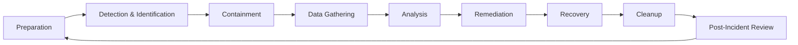

[View Cybersecurity Incident Cycle](diagram.html)

### 1. **Preparation**

**Goal**: Ensure your organisation is ready to handle cybersecurity incidents through policies, training, and security tools.

**Example**:

-   **Policy Development**: A company creates a detailed **Incident Response Plan** (IRP), outlining how to respond to different types of incidents (e.g., data breaches, malware infections).
-   **Employee Training**: Regular security awareness training is conducted to teach employees how to identify phishing emails, avoid social engineering attacks, and report suspicious activities.
-   **Implementing Security Tools**: Installing and configuring a **Security Information and Event Management (SIEM)** system to monitor network traffic and detect unusual patterns that might indicate a cyberattack.
-   **Response Team**: Assigning specific roles to individuals in the **Incident Response Team (IRT)**, such as a Lead Incident Handler, Forensic Analyst, and Communication Manager.

----------

### 2. **Detection & Identification**

**Goal**: Detect and confirm potential incidents to decide whether a security breach has occurred.

**Example**:

-   **Monitoring Alerts**: The SIEM system raises an alert that indicates a large number of failed login attempts from a foreign IP address. This could suggest a brute-force attack is underway.
-   **Log Review**: Security analysts review firewall and system logs to check for other unusual activity and to confirm whether the login attempts were malicious or benign.
-   **Initial Investigation**: The security team runs an initial analysis of user behavior, discovering that several accounts had multiple failed logins followed by successful ones, indicating that the attacker may have gained access.

----------

### 3. **Containment**

**Goal**: Limit the impact of the incident by isolating affected systems or accounts.

**Example**:

-   **Short-term Containment**: Immediately isolating the affected servers from the network to stop the attacker from accessing sensitive data or spreading malware further.
-   **Account Lockdown**: The team locks down compromised user accounts to prevent the attacker from continuing their activities.
-   **Quarantine Affected Devices**: In the case of malware, the infected computers are disconnected from the network to prevent the spread of malicious software.
-   **Preserve Evidence**: Before disconnecting devices, memory dumps are taken and logs preserved to ensure no critical forensic data is lost.

----------

### 4. **Data Gathering**

**Goal**: Collect evidence and data that will help understand the scope, nature, and origin of the incident.

**Example**:

-   **System Logs**: Collecting logs from affected systems, such as login events, file access logs, and network traffic data, to trace the attacker’s actions.
-   **Network Capture**: Capturing network traffic to identify if any data was exfiltrated from the organisation.
-   **Memory Capture**: Using forensic tools to capture a memory dump from compromised systems, which can help analysts identify running malware, hidden processes, or the attacker’s tools.
-   **User Activity Logs**: Reviewing logs from Active Directory to see which users logged in during the suspected period and whether any privileged accounts were abused.

----------

### 5. **Analysis**

**Goal**: Understand how the attack occurred, what vulnerabilities were exploited, and what data or systems were compromised.

**Example**:

-   **Root Cause Analysis**: The investigation reveals that the attacker exploited an unpatched vulnerability in a web application to gain initial access.
-   **Malware Analysis**: Analysts examine the malware found in the system to identify its capabilities, such as whether it’s designed for espionage, credential theft, or ransomware.
-   **Impact Assessment**: The team determines that the attacker accessed sensitive customer information, including financial records. This has legal and reputational implications.
-   **Attribution**: Using threat intelligence, the team matches the attack patterns to a known advanced persistent threat (APT) group that is known to target financial institutions.

----------

### 6. **Remediation**

**Goal**: Eliminate the threat and fix any vulnerabilities or misconfigurations that were exploited in the attack.

**Example**:

-   **Patching Vulnerabilities**: The team applies the necessary security patch to the web application that was exploited, ensuring that this entry point is closed.
-   **Removing Malware**: Cleaning all compromised systems of the malware and ensuring no backdoors or persistent threats remain on the network.
-   **Strengthening Defenses**: Installing **Intrusion Detection Systems (IDS)** and enabling **Multi-Factor Authentication (MFA)** across all critical systems to prevent future attacks from similar methods.
-   **Password Resets**: For all compromised or affected accounts, passwords are reset, and privileged access is reviewed.

----------

### 7. **Recovery**

**Goal**: Safely restore systems to their normal operations without the threat of reinfection or lingering issues.

**Example**:

-   **Restoring from Backups**: Rebuilding critical systems from **clean backups** to ensure they are free of malware or other threats.
-   **System Integrity Verification**: Running vulnerability scans and system integrity checks to verify that all infected systems are completely clean and no rootkits or backdoors remain.
-   **Monitoring**: After recovery, enhanced monitoring is set up to detect any signs of the attacker returning or any indicators of compromise (IOCs) that may have been missed during the initial investigation.

----------

### 8. **Cleanup**

**Goal**: Ensure all traces of the attack are removed and prepare for future security.

**Example**:

-   **Final System Scan**: A comprehensive scan is run across the network and all devices to ensure that no malware or attacker tools remain.
-   **Credential Review**: Reviewing access logs and ensuring all affected credentials (users, admins, and service accounts) have been properly reset or revoked.
-   **Decommission Compromised Systems**: Decommissioning and securely wiping any systems that cannot be salvaged due to the depth of the attack, such as those deeply compromised by rootkits.

----------

### 9. **Post-Incident Review & Learning**

**Goal**: Conduct a review of the incident response process and identify areas for improvement to strengthen future defenses.

**Example**:

-   **Post-Mortem Meeting**: The security team and other stakeholders (legal, PR, IT) conduct a post-mortem meeting to review what went well and what could be improved.
-   **Timeline Documentation**: A detailed report is created that outlines the entire lifecycle of the incident, from detection to recovery. This report can be used for auditing, legal purposes, or compliance (e.g., GDPR reporting).
-   **Improving Procedures**: The incident revealed that the patch management system was not up to date. As a result, the company implements a stricter **patch management** policy and improves communication between IT and security teams.
-   **Future Training**: Using insights from the attack, additional security awareness training is scheduled for employees, particularly around spear-phishing techniques that were used to deliver malware.

----------

### Final Note:

This framework is meant to be cyclical, so the **Post-Incident Review** feeds back into **Preparation**, ensuring that lessons learned from one incident strengthen the organisation's ability to prevent and respond to future attacks. Each step enhances the next, contributing to a more resilient cybersecurity posture.
